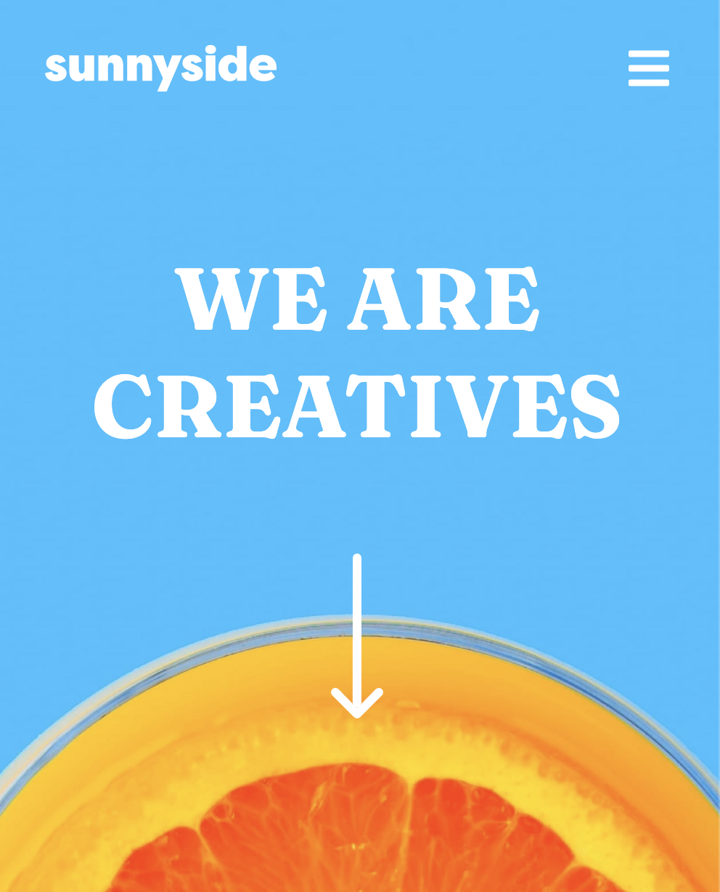
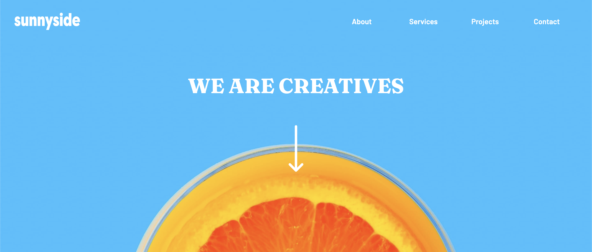

# Frontend Mentor - Sunnyside agency landing page solution

This is a solution to the [Sunnyside agency landing page challenge on Frontend Mentor](https://www.frontendmentor.io/challenges/sunnyside-agency-landing-page-7yVs3B6ef). Frontend Mentor challenges help you improve your coding skills by building realistic projects.

## Table of contents

- [Overview](#overview)
  - [The challenge](#the-challenge)
  - [Screenshot](#screenshot)
  - [Links](#links)
- [My process](#my-process)
  - [Built with](#built-with)
  - [What I learned](#what-i-learned)
  - [Continued development](#continued-development)
- [Author](#author)

## Overview

I created this landing page using CSS Flexbox

### The challenge

Users should be able to:

- View the optimal layout for the site depending on their device's screen size
- See hover states for all interactive elements on the page

### Screenshot

### Links

- Solution URL: [https://sunnysideagencybyayisha.netlify.app/](https://sunnysideagencybyayisha.netlify.app/)
- Live Site URL: [https://github.com/AyishaAlli/Sunnyside-Agency-Landing-Page](https://github.com/AyishaAlli/Sunnyside-Agency-Landing-Page)

## My process

I made the whole website first for desktop then made each section responsive

### Built with

- Semantic HTML5 markup
- CSS custom properties
- Flexbox

### What I learned

More key components to usinf Flexbox and to making them responsive.

### Continued development

As mentioned in the beginning, I built the whole website and then started to make it responsive at the end, however I have now been made aware that you should do everything in steps as opposed to leaving the responsiveness till the end)

## Author

- Website - [www.ayishaalli.com](https://www.ayishaalli.com)
- Frontend Mentor - [@yourusername](https://www.frontendmentor.io/profile/yourusername)
- Twitter - [@yayishaalli_dev](https://www.twitter.com/ayishaalli_dev)
